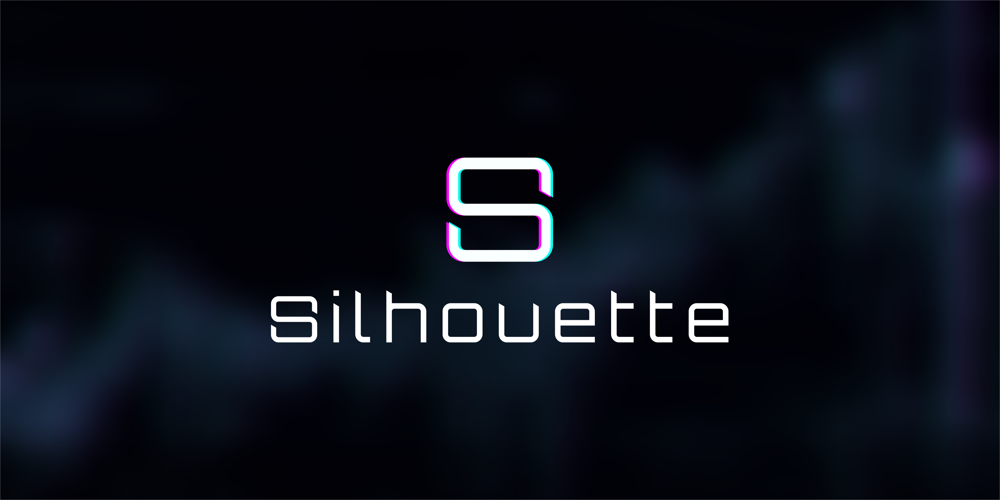

Silhouette is a decentralised trading platform that offers alternative trading types to the Hyperliquid ecosystem. Using the latest privacy technology, we provide a hidden matching engine to optimize trade executions.

Submit and complete your trade without sharing your strategies with the market.

## DeFi and Privacy
Private trading is an environment designed to keep specific trade details secret. It allows trading strategies to be executed discreetly without broadcasting every action.

This concept is not new; it is a standard part of the traditional financial system, but it has not been successfully implemented in decentralised finance (DeFi).

DeFi, as a fully open and transparent trade environment, is one of the most compelling financial innovations in recent times. But it’s not perfect or immune to problems.

With such radical transparency comes ample opportunities for exploitation and negative trading practices. Information leak through decentralised exchanges open opportunities that diminish the value of the average trade, such as the well-known Maximal Extractable Value (MEV). This reduces the length of time an alpha-generating strategy can be useful.

Even though traders know this limitation of DEX environments, few have switched to the existing DeFi private trading exchanges. This is partly because private technology for DeFi platforms often has a poor user experience, discouraging traders from continuing after battling to place simple trades.

Liquidity also presents a challenge. It is well established that privacy for the sake of privacy is not a strong enough draw for DeFi traders. If a platform does not have adequate liquidity, traders won’t see value in keeping these low-quality trades private.

We strongly believe that end-to-end privacy is a different product. Specifically, we are not designing our product to focus on privacy as the killer feature but on execution guarantees enabled by privacy.

To build this valuable private trading environment, we bring together three key elements:

Effective privacy: Protect trade details without compromising user experience

High-quality strategies: Create the environment for trading strategies to last

Liquidity: Leverage existing liquidity

## Bringing Private Trading to DeFi
DeFi and traditional finance each have their own set of standards and drawbacks. Understanding the differences between these two markets is important, as transferring the offering from one market does not guarantee success in the other. Each market has its nuances and patterns.

In traditional finance, private trading venues ensure back-channel order flow and avoid signalling large sales to the market. In DeFi, we like the idea of transparently knowing the state of the market. So, privately pushing orders as if we were a traditional private venue doesn't work. Instead, we see the application of privacy in strategies as more important. You can see the state of the market, but you can't see someone's specific strategy.

An example can be seen in centralised exchanges (CEXs). These platforms have public, open-order books, but user account information and trades are private. This allows for some information protection on who places orders and their strategy, offering only the aggregate view of the market to on-lookers.

## Our Approach
*Leveraging Liquidity*

Our traders can use the native liquidity they have on-chain through Hyperliquid. Powered by the Central Limit Order Book, trades on Silhouette will feel like a private layer on top of Hyperliquid.

*Diverse Trading Options*

Our aim is not to replace the fully transparent DEXs but to act as another avenue for traders, diversifying what is possible and bringing more value to DeFi.

Once privacy is on the table, traders can keep their views on the market secret, protect their leveraged positions, avoid front-running swaps, and not reveal a hedge. These are just a few of the trading benefits privacy opens up.

## Looking Ahead
We’re working hard to build the foundations of the next generation of DeFi trading. In our next update, we’ll share why we chose Hyperliquid as our partner on this journey and details of our technical design outlining our trading environment.

### Join Us
Follow our journey and stay informed.

[X](https://x.com/silhouette_ex) | [Website](https://silhouette.exchange/)  | [Blog](https://docs.silhouette.exchange/blog) | [Telegram](https://t.me/silhouette_exchange)