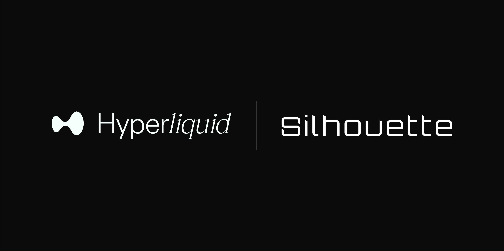

***TL;DR***

**Silhouette is building on Hyperliquid because the future of on-chain needs speed, scale and privacy.**

For an introduction to Silhouette, please see [Introducing Silhouette](/blog/2025-01-22-intro.md).

Silhouette's goal is straightforward: offering a decentralised and full-featured private trading system that does not compromise user experience. A downfall of many other private trading environments is a lack of liquidity. Hyperliquid provides this liquidity and opportunity to support Silhouette’s mission.

## Why Hyperliquid?
Hyperliquid is a purpose-built chain aiming to [‘house all finance’](https://hyperfoundation.org/). Its high performance, transaction speed, and robust liquidity create an effective and successful Decentralized Finance (DeFi) trading environment.

Liquidity is the lifeblood of DeFi. Healthy and sustainable liquidity ultimately determines the viability of crypto-economic systems. Rather than bootstrapping liquidity, the Silhouette protocol will be directly tied to the Hyperliquid L1 and HyperEVM, giving users and developers a new way to use their in-place assets in an exceptionally liquid ecosystem.

There is no need to set it up; use your wallet. There is no need to bridge; all traders' liquidity on Hyperliquid is available to use.

As the chain aspires to address fragmentation, Hyperliquid has considered traders in its development with features including:

- **Exceptional Performance**: Hyperliquid operates in milliseconds, meeting the demands of high-frequency and high-value trading.

- **Robust Liquidity**: The platform supports sustainable liquidity, ensuring better pricing and lower slippage.

- **EVM Compatibility**: Hyperliquid’s integration with EVM unlocks new possibilities, from leveraged trading to dApps with enhanced privacy.

### Hyperliquid’s roadmap
The future of Hyperliquid is as compelling as its initial offering. With a focus on expanding its ecosystem, especially the focus on EVM compatibility, there will be even more use cases. These include leveraged trading, aggregation, advanced UIs, and yield platforms - all of which can benefit from privacy enhancements offered by Silhouette.

## What Silhouette Brings to Hyperliquid
Hyperliquid provides the foundation of performance and liquidity, while Silhouette brings a critical layer of privacy that enhances the trading experience for users.

A key reason DEXs struggle with liquidity when compared to CEXs is because of the extra effort required for sophisticated actors to protect their proprietary strategies. For many traders and market makers, their order flow is their intellectual property. Silhouette’s privacy features ensure users can safeguard their strategies without sacrificing performance or liquidity.

By enabling secure, private trading, Silhouette enhances the overall value proposition of Hyperliquid, making it the go-to choice for serious DeFi traders.

### Being Fit-For-Purpose

While we see ourselves as multi-chain in the future, our immediate focus is building a platform that is fit for purpose, and Hyperliquid makes this possible. Backed by real performance, liquidity, and neutrality, we can create a next level experience currently unavailable in DeFi.

Users choose their trading venues for multiple reasons - the experience, the rewards, the community, and more. We want to enhance that experience and align with a chain that has a mission closely linked to ours - providing tools that make on-chain finance fairer and more valuable.

### Join Us
Follow our journey and stay informed.

[X](https://x.com/silhouette_ex) | [Website](https://silhouette.exchange/)  | [Blog](https://docs.silhouette.exchange/blog) | [Telegram](https://t.me/silhouette_exchange)