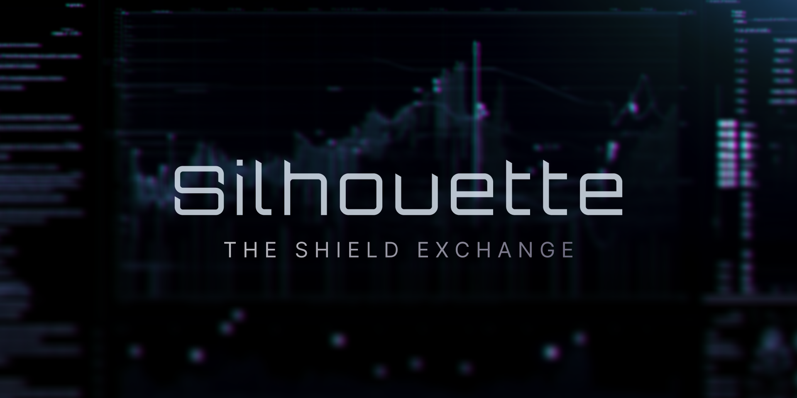

Decentralised Finance has come a long way since the DeFi Summer of 2020. What began as a movement for open, permissionless transactions has now matured into a high-speed, scalable ecosystem. But it is all out in the open – every move is completely visible to anyone watching.

At Silhouette, we believe individual confidentiality enhances the foundational benefits of DeFi: accessibility and openness. The latest developments in cryptography enable us to apply verification to outcomes at a speed that matches the current on-chain pace. A transition from full transparency to verification is crucial to the future of an on-chain financial ecosystem.

The DeFi economy will combine open financial markets with the natural desire for users to reduce the visibility of their positions within the market. Silhouette is based on the premise that open public markets and private user interactions are non-negotiable requirements to usher in an on-chain environment that fits the needs of all of finance.
<!-- truncate -->

## Introducing: The Shield Exchange
Silhouette shields your Hyperliquid trades from prying eyes, allowing you to move freely and express your ideas in absolute confidence.

We use Trusted Execution Environments (TEE) to provide order flow matching and settlement on Hyperliquid. TEEs enable us to offer a sense of speed and scale while also providing assurances that no one can view or tamper with your orders.

By offering users the choice to protect strategic trade information, we enable a sense of freedom in an ever-increasing industrial bot ecosystem looking to extract every ounce of value. If information is freely available, it will be exploited. Silhouette ensures that your actions, from placing orders to developing your overall strategy, remain protected.

A key benefit of our system is the seamless ability to trade on HyperCore and HyperEVM. Apps, users, and builder code front-ends can utilise Silhouette to make interacting with Hyperliquid’s order book as simple as possible. We see simpler interfaces benefitting swaps, liquidations, the RFQ mechanism, TWAPs, and VWAPs. We are also excited about the potential of HIP-3, stablecoins and other features we have been working on, which we will share in the coming months.

## Our thesis
In finance, information asymmetry dramatically alters outcomes. When all participants possess the same information, markets tend towards efficiency, with prices reflecting intrinsic values.

Strategies change as information sets shift; if any information is known, then it can be used in a different competing strategy. Strategic decision-making in finance is heavily dependent on the availability and distribution of information, which directly influences outcomes and market dynamics. Disclosure and reporting standards are examples of ensuring that as much information is on the same level for all users to attain.

However, each user has a set of views and preferences, and their trades are an expression of that. In DeFi, users have limited tools to keep their preferences and views private while holding a market position. It is also well established that individual behaviours change when a person knows they are being watched.

Maintaining the public availability of the overall market state while concurrently concealing individual user positions strikes an effective balance between market transparency and user privacy, which we view as the key differentiator for more financial use cases.

This approach upholds market integrity and fairness by retaining public market knowledge while also granting users a degree of protection, empowering them to engage without risk of having their strategies compromised.

## Backed by the best, who share our vision
Our industry fixed the speed and scale problem; Silhouette solves the privacy problem. The vision of Silhouette is to be the catalyst for the rest of the finance to come on-chain. Enabling users to express their views freely, in open and permissionless markets.

Silhouette is backed by a $3 million pre-seed round led by [RockawayX](https://www.rockawayx.com/), which includes investors such as [Amber Group](https://www.ambergroup.io/), [HiveMind](https://www.hivemind.capital/), [No Limit Holdings](https://nolimitholdings.xyz/), and [Protagonist](https://www.protagonist.co/). We are also extremely thankful for our angels from HyperActive.

### Join Us
Follow our journey and stay informed.

[X](https://x.com/silhouette_ex) | [Website](https://silhouette.exchange/)  | [Blog](https://docs.silhouette.exchange/blog) | [Telegram](https://t.me/silhouette_exchange)