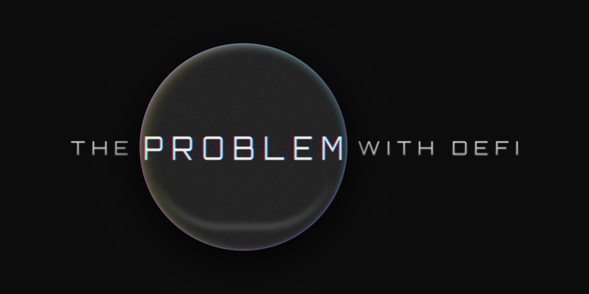

_Part one of a three-part series on the future of shielded trading._

Decentralized Finance (DeFi) is one of crypto’s boldest promises: an open, borderless financial system that anyone can access with nothing more than a wallet and an internet connection.

And to be fair, it has delivered. DeFi protocols now hold over [$114 billion](https://defillama.com/) in value. Billions move daily through decentralized exchanges and perpetuals. Financial primitives like lending, swaps, and synthetic assets are now programmable and permissionless.

But for all the technical achievement and excitement, DeFi is still stuck in a loop, haunted by the same issues that have plagued it for years.

This article doesn’t focus on solutions. It focuses on the rot at the foundation, the systemic trade-offs that make DeFi vulnerable, exploitable, and often unusable for the very people it’s meant to empower. If you’re looking for our solutions to some of these problems, read our article on [Silhouette’s mission and vision for DeFi](/blog/redefiningdefi).

## The Good: DeFi Has Product-Market Fit
DeFi _works_. It’s global. It’s composable. And it’s accessible in a way that TradFi never could be. In markets where traditional infrastructure is broken, DeFi fills the gap with programmable money and uncensorable access.

Millions have onboarded. A new generation of financial tools have emerged. But the question is no longer “does it work?” It’s “who is it working for?”

## The Bad: It’s Still Broken for Most Users
Exploits. Bridge hacks. Rug pulls. Phishing. It’s hard to trust an industry where losing your life savings is one misclick away.

But worse than the risk is the UX.

DeFi is still alien to most users. Interfaces are clunky. Transaction flows are unintuitive. There are no safety nets. For most, it’s easier and safer to stay on a centralised exchange (CEX).

And even for power users, there’s a deeper problem that undermines the entire structure: everything you do is public.

## Transparency: The Feature That Became a Flaw
DeFi, up until now, has worshipped transparency. It’s what makes protocols verifiable and trustless. But in practice, it creates an information imbalance - a market structure where the most aggressive, technical actors feast on everyone else.

Every transaction reveals intent. Every wallet exposes a portfolio. Every action is a signal. And for those watching, there’s money to be made.

This isn’t theoretical. In 2024 alone, over [$968M was extracted](https://www.eigenphi.io/) via MEV. That’s not a fringe issue, that’s systemic leakage. Value drained before a trade executes, simply because it was broadcasted in the open.

And MEV is just the start:

- **Copy trading** scrapes public addresses to replicate positions.

- **Sniping bots** wait for high-leverage liquidations.

- **Quote fading** exploits slippage after seeing your size.

In other words, DeFi gives everyone a Bloomberg terminal, but forces you to shout your trades into it.

The surface-level story says DeFi is fair because it’s transparent. But fairness isn’t about openness, but rather about equal footing.

Right now, most users operate blind while adversaries have a real-time edge. Builders are chased by forked clones. Traders are chased by bots. Institutions are chased away entirely.

This isn’t just bad UX, it's a broken market structure.

## The Hyperliquid Exception?
To be fair, some platforms are raising the bar. [Hyperliquid](https://hyperfoundation.org/) has proven that onchain doesn’t have to mean slow, illiquid, or clunky.

It clears over $60B in weekly volume, with over [60% market share](https://dune.com/uwusanauwu/perps) among perps DEXs. And it does it all with native support for composability.

But even here, the transparency issue persists. Better performance doesn’t remove the fact that order flow is exposed. Your strategy is still public. And alpha still leaks.

Imagine a president announcing his every move before a public event. The route, the motorcade and the security detail.

This isn’t transparent, it's a security risk.

In DeFi, traders do the same thing unwillingly. The moment you sign a transaction, your intent becomes public. Price, size, direction - everything visible before it executes.

That’s not fair, and it’s not secure. And it’s not how serious markets operate.

## What This Series Is Really About
This isn’t about dismissing DeFi. It’s about surfacing the contradictions we’ve buried under buzzwords.

The next article in this series will look at the failed privacy experiments that came before and why they couldn’t scale.

For now, just remember: in DeFi, transparency is a double-edged sword. And right now, it’s cutting the wrong side.

### Join Us
Follow our journey and stay informed.

[X](https://x.com/silhouette_ex) | [Website](https://silhouette.exchange/)  | [Blog](https://docs.silhouette.exchange/blog) | [Telegram](https://t.me/silhouette_exchange)