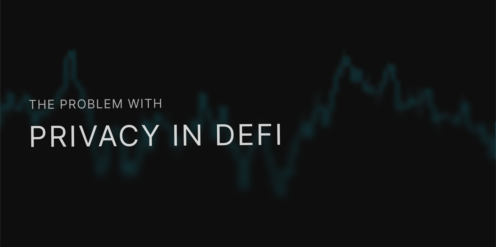

*Part two of our three-part look at shielded trading.*

Last week we argued that radical transparency turns DeFi into open season for front-running and strategy degradation. This follow-on asks a tougher question: what happens when we swing the pendulum the other way and hide everything?

Short answer: hiding everything often hurts more than it helps. Trading into complete darkness is scary.

## Early privacy implementations and their shortcomings
### Mixers
Tornado Cash proved you can break the wallet-to-wallet link. It also proved regulators can break your liquidity. After OFAC’s August 2022 sanction, volume through the mixer fell by roughly 85 percent, sliding from $2.8 billion in the six months before the ban to [$425 million a year later](https://www.trmlabs.com/resources/blog/tornado-cash-volume-dramatically-reduced-post-sanctions-but-illicit-actors-are-still-using-the-mixer).  

Privacy survived, users did not.

### Privacy L1s
Blockchains like Monero and Zcash protect every output, yet liquidity lives where traders meet. When OKX announced it would delist major privacy pairs on **5 January 2024**, [daily volumes and prices slipped across the sector](https://blockworks.co/news/crypto-exchanges-delisting-privacy-coins). 

A private rail with no major on-ramps becomes a dead end.

### Early Dark Pool DEXs

Teams built fully encrypted swaps to keep order flow dark. They pushed the science forward, but market depth stayed shallow:
- Penumbra’s TVL hovers near [$12k](https://defillama.com/protocol/penumbra-dex?dexVolume=true&events=false&tvl=false) and clears low-hundreds in daily volume. 
- Renegade’s TVL is around [$210k](https://defillama.com/protocol/renegade), with negligible volumes.
- SecretSwap secures about [$480k](https://defillama.com/protocol/secretswap?denomination=USD).

These numbers expose the network-effect cliff, not the quality of the code. Big pools attract bigger pools, which hide the signals “Makers” use to hedge.The result is that they will either quote a wide spread or walk away. Users on aggregate follow the tightest spread, so flow migrates back to transparent giants.

## UX and compliance friction
Shielded rails promise safety, but they slow you down. First you deposit, then you wait for an anonymity set, pay proof gas, and bridge or wrap. In a market that clears in seconds, each extra click feels like a tax.

Couple this with regulation and you have unnecessary weight. By using a sanctioned mixer means every compliance desk will freeze your address. The result of this means that big capital that could tighten spreads will steer clear, leading to no meaningful depth ever forming.

Even when the tech hides your address, the timing and size of any trade will still leave a trail. If a grad student can trace it, a sniper bot can too. This meant that teams chased perfect secrecy end-to-end and, in the process, traded away a product people can use.

## The takeaway
Version-one privacy tools hid everything. In doing so they stripped out the information that markets need to function, swapping alpha (strategy) leakage for a liquidity drought.

Markets do not need to see your plan before the trade gets filled. They do need to see the trade’s fill after it lands and is settled. That insight shapes what comes next.

## Up next
Part three tests the hypothesis: keep intent secret, keep execution public. Trusted hardware makes that split possible. Same open ledger, zero alpha leak. Stay tuned.

### Join Us
Follow our journey and stay informed.

[X](https://x.com/silhouette_ex) | [Website](https://silhouette.exchange/)  | [Blog](https://docs.silhouette.exchange/blog) | [Telegram](https://t.me/silhouette_exchange)