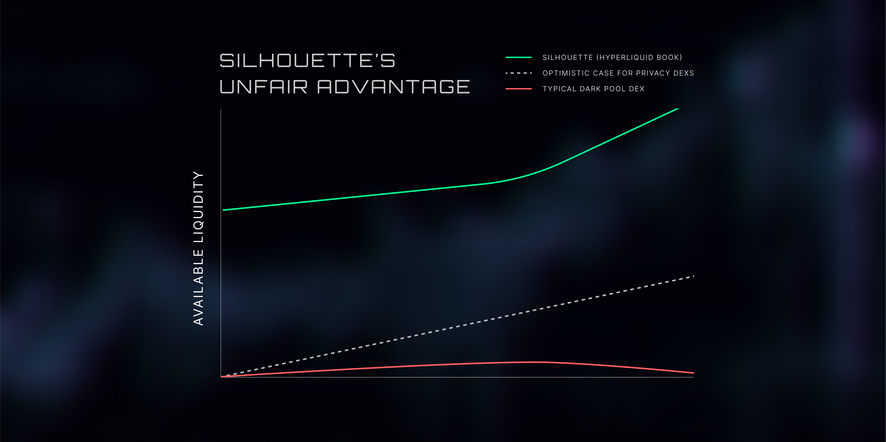

*Part three in our series on shielded trading*

Dark pools promised to fix DeFi’s biggest flaw: open exposure.

For traders hunted by bots and shadowed by copycats, they offered something revolutionary,  institutional-grade privacy.

By hiding order flow, they aimed to level the playing field. And on paper, that made sense.

But in practice, they became liquidity graveyards. The traders they were meant to serve stayed away. Makers refused to quote. Spreads widened. Volumes flatlined.

So what went wrong?

## The Instinct Was Right: Transparency Hurts Traders

As we explored in [Part One](https://mirror.xyz/0x5D2c2bD98F10616771D7B5124AD2090Ba72Aa43c/gFa2W0--Ref6ManqQ27m8drQAYqCNblOwjCeRJiYzZI), DeFi’s radical transparency exposes traders to all kinds of risk. When your order is visible before it executes, it becomes a target. MEV bots, copy traders, and snipers all thrive on this visibility.

Naturally, the response was to go the other way. Hide everything. Encrypt every layer. Remove signals from the system.

But this is where the pendulum swung too far.

Dark pools didn’t fail because the problem was wrong. They failed because the solution was incomplete.

As Jeff, founder of Hyperliquid, [put it](https://x.com/chameleon_jeff/status/1928883871644528890):
> “Dark pools do not solve the main problems of crypto trading. Instead they throw out all the good parts of public blockchains and keep the bad.” 

Dark pools removed visibility without offering a better coordination mechanism. Traders need protection, but they also need liquidity. They need tight spreads, fast settlement, and the confidence that their counterparties will show up.

In short, they need functioning markets.

And functioning markets rely on more than secrecy. They rely on signal.

Let’s look at what happened in practice:
- **Penumbra**: ~$12,000 in TVL

- **Renegade**: ~$210,000 in TVL

- **SecretSwap**: ~$480,000 in TVL

These were not poorly engineered products. In fact, they were serious attempts at solving a real problem. But the much-needed liquidity never came and volumes never picked up, preventing meaningful depth from ever forming.

These dark pools created total privacy, but they also created total silence. Without visibility into the order book or intent, market makers could not hedge or quote effectively. Spreads widened, users left, and the feedback loop collapsed before it could start.

Again, Jeff captured the [deeper issue](https://x.com/chameleon_jeff/status/1929753039969440212):
> “The important thing is coordination… A successful crypto exchange is not about copying NYSE but rebuilding coordination with different primitives.”

## Breaking Down The Failure

There were three core reasons these systems failed to gain traction:
### 1. Too private, too early
Hiding everything stripped out the minimal information that market makers need to function. In traditional markets, even dark pools provide post-trade transparency and rely on a lit reference price to anchor quotes. DeFi dark pools often removed both. As a result, they attracted neither market makers nor users.
### 2. User experience friction
Privacy was often bolted on in ways that made usage painful. To trade, users had to deposit funds, wait for an anonymity set to form, pay high proof-generation fees, and then bridge or wrap tokens. In a world where execution is measured in milliseconds, this kind of friction becomes a dealbreaker.
### 3. The liquidity spiral
Tight spreads attract flow. Flow attracts more liquidity. But when spreads are wide and depth is thin, users abandon ship. Dark pools struggled to bootstrap this cycle because the starting conditions were too constrained. Privacy was prioritised at the cost of usability.

The end result? Empty pools, despite good intentions.

## What Markets Actually Need
Privacy is important. But it must be designed in service of the market, not at its expense.

What markets need is a balance:
- **Keep order intent private before execution**
- **Make execution data public after the trade settles**

This preserves strategic privacy while maintaining the visibility markets rely on to function. It allows traders to shield their [alpha](https://www.investopedia.com/terms/a/alpha.asp), while still anchoring coordination. Makers can still quote, takers can trust and liquidity can still be allowed to form.

This is the backbone of every functional market. Even in TradFi, dark pools operate alongside visible reference prices and post-trade reporting. Coordination and trust do not come from hiding everything, but rather from shielding the right things.

## What Makes Silhouette Different
Silhouette is not just another dark pool. It is a shielded execution layer built on Hyperliquid – one of the fastest, deepest and most composable chains in DeFi.

We do not hide everything. We shield intent.

- Orders are encrypted inside secure hardware enclaves (TEEs) before execution
- After execution, the fill price, volume, and timestamp are posted publicly
- This preserves trader privacy without sacrificing coordination

You can think of it like public transit. Everyone sees the timetable, but no one knows who sat in seat 12C. By protecting the strategy and exposing the outcome, Silhouette strikes the balance that previous designs missed.

## Learn, Adapt, Build

The first generation of dark pools misunderstood what markets actually need. They focused on secrecy, but ignored coordination. They built cryptography, but forgot liquidity.

Silhouette learns from those mistakes.

We do not believe privacy and performance are in conflict. We believe they can coexist. But only if we treat markets as living systems, not puzzles to be solved in a vacuum.

Privacy, alone, is not a product. But usable, composable, shielded trading?

That is a new foundation.

### Join Us
Follow our journey and stay informed.

[X](https://x.com/silhouette_ex) | [Website](https://silhouette.exchange/)  | [Blog](https://docs.silhouette.exchange/blog) | [Telegram](https://t.me/silhouette_exchange)