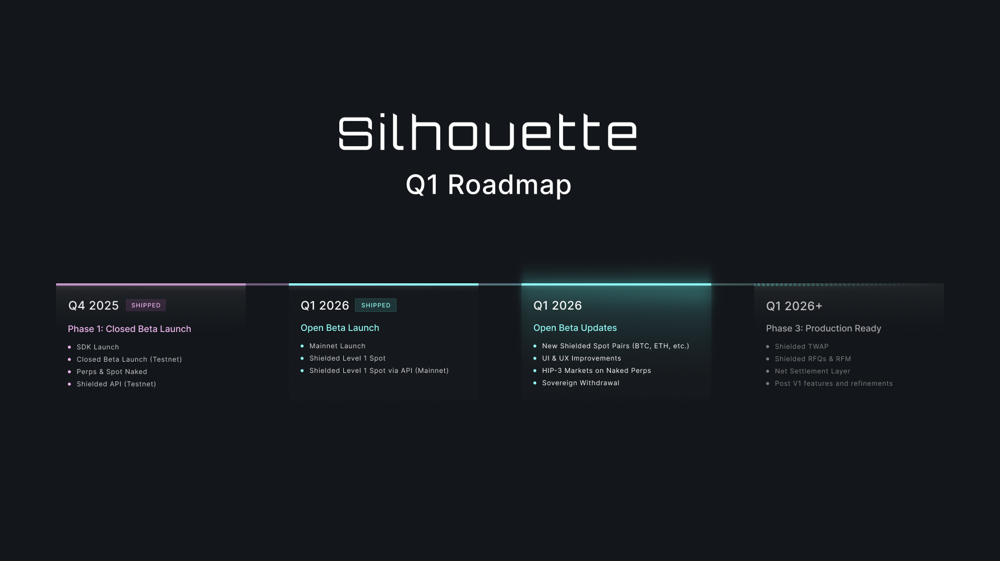

Over the last few months, we’ve been working with a series of traders and users refining the shielded experience. Today, we go live in an open beta. 

## What We're Launching

Spot HYPE/USDC using our shielded feature. 

The feature is accessible via our [Silhouette App](https://app.silhouette.exchange) and [API](https://docs.silhouette.exchange/docs/api).

Via the App, you can trade:
- Naked: Works exactly as it does on Hyperliquid or any Builder Code frontend.
- Shielded: Using the Silhouette environment and a delegated wallet to execute trades on the user’s instruction. 

## How It Works

Silhouette's trading mechanism starts with users depositing funds into a contract. This wallet processes and executes trades based on instructions from the Silhouette TEE (Trusted Execution Environment), which the user initiates.

**User funds remain under user control**. They can only be managed via the user's original wallet. The Silhouette system can only process orders originating from the user's wallet and has no direct control over the user's funds without explicit instructions.

Trades are executed directly on the Hyperliquid orderbook using the Silhouette system. Once a trade is completed, user balances are encrypted within a smart contract. This smart contract will be essential for our upcoming Sovereign Withdrawal feature, which ensures access to funds even if the Silhouette system is unavailable.

Silhouette supports policy engines as part of our plan to introduce compliance into our system. While we strongly advocate for open finance principles, we also recognise the need to make crypto markets more accessible to traditional financial participants. This is a nuanced and technical topic which deserves its own deep dive. 
If you represent a fund or any institutional entity interested in utilising this feature from its launch, please contact us through our public Telegram group to arrange access.

## Why This is Beneficial

The system is the first step toward a fully fledged execution engine that can directly integrate with Hyperliquid order books. 

The current version enables a series of use cases: 
- User trades are shielded by the wallet's total trading volume, with higher volume making individual activity harder to isolate.
- Silhouette wallets will soon get lower fees. We are working with partners to make Silhouette the cheapest venue to buy HYPE. More on this soon
- The TEE is a conduit for users' intents on Hyperliquid while always maintaining funds are controlled by the users.

With the above in mind, soon HIP-3 deployers, Spot buyers and [Spot Equities](https://x.com/WaynesWorldza/status/2016110304858427619?s=20) buyers will be able to discretely accumulate the required HYPE and other spot assets at the best possible price anywhere. This will be complimented with customisable policy engines for all your compliance needs.

## What's Next

This is just the first phase. Here is what to expect next:
- More pairs rolled out to the shielded feature. Community requests are welcome.
- HIP-3 markets support on the naked perps side.
- Shielded TWAP and VWAP order types as part of our iceberg suite.
- Request for Quote (RFQ) and Request for Match (RFM) infrastructure for larger workflows introduced. We’re looking for early users and market makers to test and shape this design. If that’s you, please reach out.
- Net Settlement layer for reduced price impact by furthering our shielded offering.
- While supported on day one of our launch, we will share more details on our policy engines and how they enable more use cases on-chain.
- Future releases will introduce deeper intent protection, more expressive order types, and fully confidential routing that still settles in public.

Trade now: https://app.silhouette.exchange 

Want programmatic access? Reach out via our [Telegram Community Channel](https://t.me/+G8s-CgieXWs4YjA8).