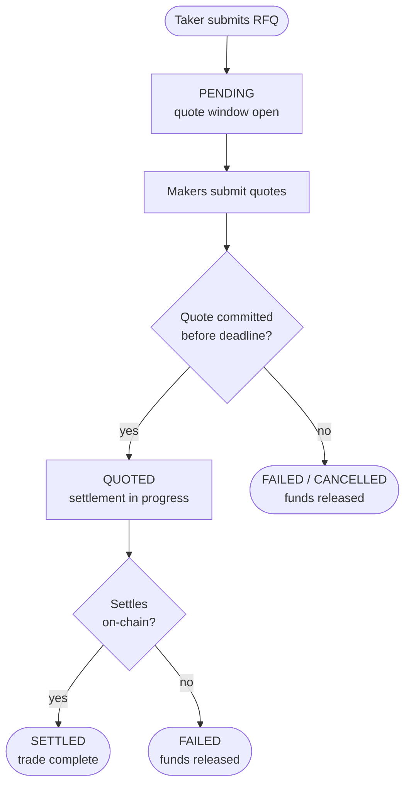

:::tip[Building on RFQ?]
This page explains the concepts. For endpoints, request fields, responses, and schemas, go to the [RFQ API Spec](/api/spec).
:::

An RFQ, or request for quote, is a trading workflow where a taker asks makers for executable prices on a specific instrument. The system is designed to work across HyperEVM and HyperCore, giving traders one universal flow to execute against all the available instruments on Hyperliquid.

The flow is built to span instruments such as:

- Tokenized assets issued on EVM
- Larger perp positions on HyperCore or through HIP-3 deployers
- Spot assets on HyperCore or HyperEVM

## Main actors

### Takers

The taker is the account requesting liquidity. A taker creates the RFQ, reviews quotes when using manual acceptance, accepts a quote or waits for auto-selection, and tracks the final trade state. A taker can hold funds on either HyperCore or HyperEVM. Settlement abstracts away which chain the funds are on and returns funds to the same chain the taker initiated from.

### Makers

The maker is a liquidity provider. A maker watches for open RFQs on supported instruments and submits quotes. As with takers, maker funds are abstracted away from the chain: the maker responds to an RFQ and settlement handles the chain abstraction.

Makers gain capital efficiency from how settlement is authorized. A maker can quote against inventory that is currently working elsewhere — an **inventory-mode** maker settles from its own balance, while an **xchange-mode** maker settles through an external venue by attaching a settlement bundle to the quote (see [`createMakerQuote`](/api/spec/maker#post-v1-rfq-quotes)). Each quote carries an expiry, and the engine binds that expiry to an on-chain [Permit2](https://github.com/Uniswap/permit2) deadline, so a maker commits to deliver the asset only within a bounded window. The objective is to let makers quote more competitively without parking idle inventory.

### Silhouette

Silhouette is the coordinator that sits between takers and makers and runs the RFQ lifecycle. It matches the taker's request, receives maker quotes, selects or records an accepted quote, locks and releases balances as needed, exposes the final trade status, and uses the CoreWriter contracts to manage cross-chain transfers. Takers and makers never interact directly — every step passes through Silhouette.

## Instruments

Each RFQ is for one instrument, such as `XTSLA-USDC-SPOT`. The canonical instrument ID has the form `BASE-QUOTE-TYPE` and identifies the base token, the quote token, and the product type (for example `SPOT`). See [InstrumentId](/api/spec/schemas#instrumentid) for the exact format.

Today the RFQ surface models tokenized instruments. The `TYPE` segment is what lets the same flow generalize, and the roadmap extends instrument coverage to HyperCore perps and spot assets so takers and makers reach them through the same RFQ workflow described here. Until then, expect the supported instrument set to grow rather than the workflow to change.

The taker sends a `side`:

- `BUY` means the taker wants to buy the base asset and is setting the maximum quote amount they will pay.
- `SELL` means the taker wants to sell the base asset and is setting the minimum quote amount they will accept.

The taker also sends `baseQty`, the amount of base asset to trade, and `quoteLimit`, the taker's price boundary.

## Quote window

Every RFQ has a quote window. During this window, makers can submit competing quotes. A short window favors faster execution. A longer window gives more makers time to respond and can improve price discovery.

If the taker omits `windowSecs`, Silhouette uses the operator-configured default. The server clamps the value to the allowed range, and the bound is coupled to the maximum quote lifetime so a quote stays acceptable for the entire window.

## Auto-acceptance (two-round flow)

In the two-round flow the taker submits and makers quote — there is no separate acceptance step. The taker submits an RFQ with `autoAccept: true`, Silhouette waits until the quote window closes, then automatically selects the best conforming quote. Funds lock at RFQ submission rather than at acceptance.

If there is no fillable quote by the deadline, the RFQ fails and locked funds are released. Auto-acceptance is useful when the taker wants the best available quote at the end of the window without a second decision step.

## Manual acceptance (three-round flow)

The three-round flow adds a third round — the taker reads the quotes and accepts one — in exchange for control over which quote wins.

The taker submits an RFQ with `autoAccept: false` (or omits `autoAccept`, the default). The RFQ enters `PENDING` while makers submit quotes. The taker reads the competing quotes with [`listRfqRequestQuotes`](/api/spec/rfq#get-v1-rfq-requests-id-quotes) and explicitly accepts one with [`acceptRfqQuote`](/api/spec/rfq#post-v1-rfq-requests-id-accept) before the deadline.

Funds lock when the taker accepts a quote. After acceptance, the RFQ moves toward settlement. If settlement succeeds, the RFQ becomes `SETTLED`. If the selected maker does not deliver or settlement cannot complete, the RFQ becomes `FAILED` and locked funds are released.

Manual acceptance is useful when the taker wants to inspect quotes before committing. Rate limits apply to this flow to discourage spam.

## Maker quoting

Makers discover open RFQs through [`listMakerRequests`](/api/spec/maker#get-v1-rfq-requests-open), which returns the open RFQs on the pairs the maker is approved to quote. A maker submits a quote with [`createMakerQuote`](/api/spec/maker#post-v1-rfq-quotes).

A quote describes what the maker pays and what the maker receives. Quotes start as `SUBMITTED`. Before selection, a maker can cancel a still-submitted quote with [`cancelMakerQuote`](/api/spec/maker#post-v1-rfq-quotes-quoteid-cancel); to re-price, the maker submits a fresh quote for the same RFQ. At the deadline, selection marks one quote `SELECTED` and the rest `NOT_SELECTED` (or `EXPIRED` if the window closes with no winner).

When a quote is selected, the maker reads it back through [`listMakerQuotes`](/api/spec/maker#get-v1-rfq-quotes). A `SELECTED` quote carries the engine-signed Permit2 authorization the maker relays on-chain to settle.

## Trade lifecycle

Each branch resolves to one of the lifecycle states below. The no-commit branch splits by mode: an auto-accept RFQ with no fillable quote ends `FAILED`, while a manual RFQ that hits its deadline with nothing accepted ends `CANCELLED`. Status values are returned in `SCREAMING_SNAKE_CASE`; see [RfqStatus](/api/spec/schemas#rfqstatus) for the authoritative list.

| Status | Meaning | Terminal |
|--------|---------|----------|
| `PENDING` | Auction open; quotes may be arriving. | No |
| `QUOTED` | A quote was accepted or auto-selected; settlement is in progress. | No |
| `SETTLED` | Settled on-chain; a completed trade carrying a settlement transaction hash. | Yes |
| `FAILED` | Could not complete — no fillable quote in auto-accept, insufficient balance, or a selected maker not delivering. Locked funds are released. | Yes |
| `CANCELLED` | A manual-acceptance RFQ reached its deadline with nothing accepted. No funds move. | Yes |

## Balances and reconciliation

The RFQ surface exposes balances and a ledger so integrators can reconcile account state.

Balances show available, locked, and total amounts by token. The ledger is an append-only audit trail for balance changes such as deposits, fills, withdrawals, and adjustments. See the [Balances](/api/spec/balances) reference.

Deposits and withdrawals are separate funding operations. Withdrawals are asynchronous and use the account's registered destination; the caller does not provide a destination address in the withdrawal request. See the [Funding](/api/spec/funding) reference.

## Developer reference

For exact endpoints, request fields, responses, and schema definitions, start at the [RFQ API Spec](/api/spec). Authentication is covered in [RFQ API authentication](/api/spec/authentication).
