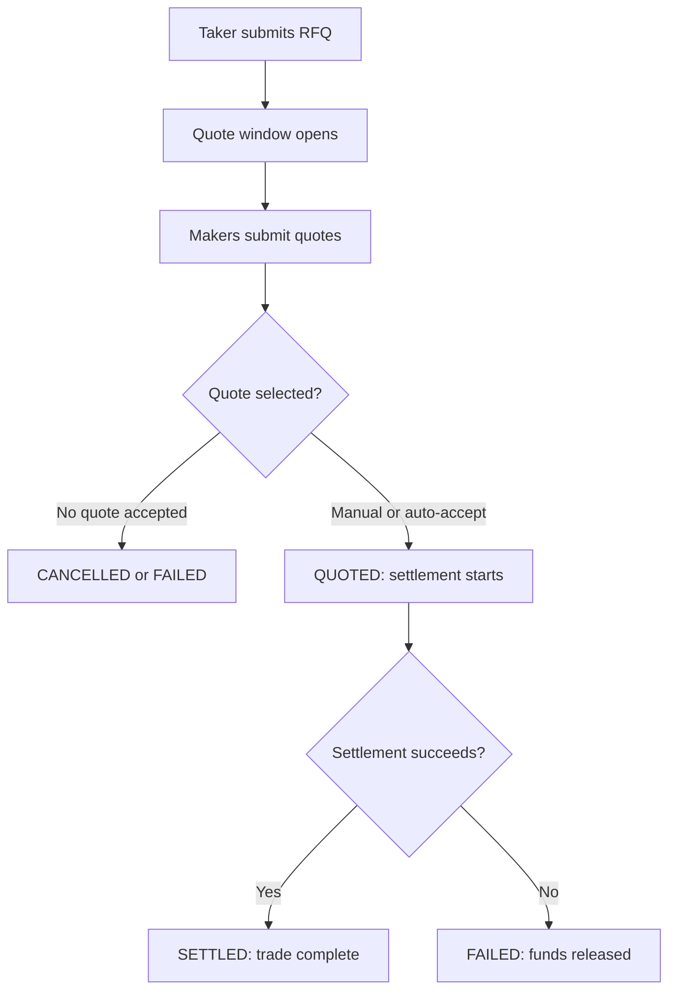

:::warning
The Silhouette RFQ flow is in beta and may change as RFQ workflows evolve.
:::

An RFQ, or request for quote, is a trading workflow where a taker asks makers for executable prices on a specific instrument. The system is designed to work across HyperEVM and HyperCore. The design of the system is create a unverisal flow for traders to execute across all the avilable instrustments on Hyperliquid.

Examples can be:
- Tokensized assets issuers on EVM
- Larger perp positions on HyperCore or through HIP3 deployers
- Spot assets on HyperCore or HyperEVM

## Main actors

### Takers
The taker is the account requesting liquidity. A taker creates the RFQ, reviews quotes when using manual acceptance, accepts a quote or waits for auto-selection, and tracks the final trade state. The user can have funds on either HyperCore and HyperEVM. The settlement process abstracts which chain the users funds are on and sends the funds back to same chain the user initated the transaction from.

### Makers
The maker is a liquidity provider. A maker watches for open RFQs on supported instruments, submits quotes and responds to promises. In the same way the taker funds are abstatracted away from the chain, the same can be applied to maker flows. The maker simply reponds to an RFQ and the settlment process handles the chain abstraction.

An advantage for makers is to make use of the promise system. A promise is an obglation for a maker to deliver the asset within a time bound. This allows makers to respond to quotes with invetory currently being used in the order book. The objective of the system is to be capital effecicent and allow makers to quote more effectively.

Silhouette coordinates the RFQ lifecycle. It matche the taker's request, receives maker quotes, selects or records an accepted quote, locks and releases balances as needed, exposes the final trade status, and makes use of the CoreWrite contracts to manage cross chain transfers.

## Instruments

Each RFQ is for one instrument, such as `XTSLA-USDC`. The instrument identifies the base token, quote token, and product type. In v1, the RFQ surface models tokenized instruments.

The taker sends a `side`:

- `BUY` means the taker wants to buy the base asset and is setting the maximum quote amount they will pay.
- `SELL` means the taker wants to sell the base asset and is setting the minimum quote amount they will accept.

The taker also sends `baseQty`, the amount of base asset to trade, and `quoteLimit`, the taker's price boundary.

## Quote window

Every RFQ has a quote window. During this window, makers can submit competing quotes. A short window favors faster execution. A longer window gives more makers time to respond and can improve price discovery.

If the taker omits `windowSecs`, Silhouette uses the operator-configured default. The server clamps the value to the allowed range.

## Auto-acceptance

The taker submits an RFQ with `autoAccept: true`. Silhouette waits until the quote window closes, then selects the best conforming quote automatically. In this mode, funds lock at RFQ submission rather than at manual acceptance.

If there is no fillable quote by the deadline, the RFQ fails and locked funds are released. Auto-acceptance is useful when the taker wants the best available quote at the end of the window without a second decision step.

## Manual acceptance

Manual acceptance requires more steps but allows the user to select a specific quote.

The taker submits an RFQ with `autoAccept: false` or omits `autoAccept`. The RFQ enters `PENDING` while makers submit quotes. The taker reads the competing quotes and explicitly accepts one before the deadline.

Funds lock when the taker accepts a quote. After acceptance, the RFQ moves toward settlement. If settlement succeeds, the RFQ becomes `SETTLED`. If the selected maker does not deliver or settlement cannot complete, the RFQ becomes `FAILED` and locked funds are released.

Manual acceptance is useful when the taker wants to inspect quotes before committing. Note there will be limitations on this process to avoid spam protection.

## Maker quoting

Makers discover open RFQs through the maker request endpoint. A maker can submit a quote for an RFQ it is approved to quote.

A quote describes what the maker pays and what the maker receives. Quotes start as `SUBMITTED`. Before selection, a maker can cancel a still-submitted quote. To re-price, the maker submits a fresh quote for the same RFQ.

When a quote is selected, the maker sees the selected quote through the maker quote view. Selected quotes include the settlement authorization the maker needs to relay on-chain.

## Trade lifecycle

## Lifecycle states

An RFQ starts as `PENDING`. This means the auction is open and quotes may be arriving.

When a quote has been accepted manually or selected automatically, the RFQ becomes `QUOTED`. This means settlement is in progress.

If settlement completes on-chain, the RFQ becomes `SETTLED`. A settled RFQ is a completed trade and includes a settlement transaction hash.

If the RFQ cannot complete, it becomes `FAILED`. Common reasons include no fillable quote in auto-accept mode, insufficient balance, or a selected maker not delivering. Locked funds are released.

If a manual-acceptance RFQ reaches its deadline without a quote being accepted, it becomes `CANCELLED`. No funds move.

## Balances and reconciliation

The RFQ surface exposes balances and a ledger so integrators can reconcile account state.

Balances show available, locked, and total amounts by token. The ledger is an append-only audit trail for balance changes such as deposits, fills, withdrawals, and adjustments.

Deposits and withdrawals are separate funding operations. Withdrawals are asynchronous and use the account's registered destination; the caller does not provide a destination address in the withdrawal request.

## Developer reference

For exact endpoints, request fields, responses, and schema definitions, use the [RFQ API Spec](/docs/api/spec).
