# System Flows & Roadmap

This document provides visual representations of Silhouette's system architecture and outlines the development roadmap for upcoming features.

## Architecture Flow Diagrams

### Complete Trading Flow: UI → Contract → TEE → Hyperliquid

```mermaid
graph TB
    User[👤 User] --> WebApp[🌐 Silhouette WebApp]
    User --> Wallet[👛 EVM Wallet]
    
    WebApp --> |1. Generate Keys| Browser[🔒 Browser Storage]
    WebApp --> |2. Encrypt Orders| Contract[📜 Smart Contract]
    Wallet --> |3. Sign Transactions| Contract
    
    Contract --> |4. Store Encrypted| HyperEVM[(🔗 HyperEVM)]
    Contract --> |5. Emit Events| TEE[🛡️ Trusted Execution Environment]
    
    TEE --> |6. Decrypt Orders| MatchingEngine[⚙️ Matching Engine]
    MatchingEngine --> |7. Find Matches| TEE
    TEE --> |8. Batch Settlements| HyperCore[(⚡ HyperCore)]
    
    HyperCore --> |9. Update Balances| Hyperliquid[🏛️ Hyperliquid]
    Hyperliquid --> |10. Settlement Events| Contract
    Contract --> |11. Update State| WebApp
    
    style TEE fill:#f9f,stroke:#333,stroke-width:4px
    style Contract fill:#bbf,stroke:#333,stroke-width:2px
    style WebApp fill:#bfb,stroke:#333,stroke-width:2px
```

### Order Lifecycle Flow

### Encryption Key Management Flow

### Deposit & Withdrawal Flow

### Multi-User Trading Interaction

## System Components Deep Dive

### Component Interaction Matrix

| Component | Smart Contract | TEE | WebApp | HyperCore | User Wallet |
|-----------|----------------|-----|---------|-----------|-------------|
| **Smart Contract** | - | Events & Calls | State Updates | Settlement | Transactions |
| **TEE** | Event Monitoring | - | Encrypted Data | Direct Settlement | None |
| **WebApp** | Read/Write | Via Contract | - | Balance Queries | Connection |
| **HyperCore** | Settlement Events | Batch Updates | Balance Display | - | Deposits/Withdrawals |
| **User Wallet** | Signing | None | Authentication | Direct Transfer | - |

### Data Flow Architecture

## Development Roadmap

### Current Status (Alpha Phase)

:::info Current Features ✅
- **Limit Orders**: Full implementation with encrypted order book
- **HYPE/USDC Trading**: Primary trading pair supported  
- **End-to-End Encryption**: Complete privacy for order details
- **Wallet Integration**: MetaMask, WalletConnect, hardware wallets
- **TEE Matching**: Secure order matching in trusted environment
- **Batch Settlement**: Efficient settlement via HyperCore
:::

### Q2 2025: Market Orders & Enhanced UX

**Key Features:**

🎯 **Market Orders**
- Immediate execution at best available prices
- Intelligent slippage protection
- Integration with existing limit order book

🎯 **Advanced Order Types**
- Stop-loss orders
- Take-profit orders  
- Conditional orders based on external triggers

🎯 **Enhanced Mobile Experience**
- Improved responsive design
- Touch-optimized trading interface
- Mobile-specific performance optimizations

🎯 **SDK Improvements**
- CCXT-compatible interface
- Enhanced Python SDK with async support
- Real-time WebSocket API

### Q3 2025: Perpetual Trading & Scalability

**Key Features:**

🚀 **Perpetual Contracts**
- Leverage trading with up to 10x leverage
- Funding rate mechanisms
- Cross-margin and isolated margin options

🚀 **Scalability Improvements**
- Multiple TEE instances for higher throughput
- Layer 2 integration for reduced gas costs
- Enhanced batch processing

🚀 **Portfolio Management**
- Real-time P&L tracking
- Risk metrics and exposure analysis
- Position management tools

### Q4 2025: Multi-Asset & Institutional Features

**Key Features:**

🏛️ **Multi-Asset Support**
- ETH/USDC, BTC/USDC trading pairs
- Additional altcoin pairs based on demand
- Cross-asset portfolio management

🏛️ **Institutional Features**
- High-volume API endpoints
- Compliance reporting tools
- Custom fee structures
- White-label solutions

🏛️ **Native Mobile Apps**
- iOS and Android native applications
- Biometric authentication
- Push notifications for order fills
- Offline key management

### 2026: Advanced Privacy & Cross-Chain

**Vision for 2026:**

🔮 **Enhanced Privacy**
- Zero-knowledge proof integration
- Enhanced anonymity sets
- Quantum-resistant encryption

🔮 **Cross-Chain Expansion**
- Ethereum mainnet integration
- Multi-chain asset support
- Unified liquidity across chains

🔮 **Algorithmic Trading Platform**
- Strategy marketplace
- Backtesting infrastructure
- Copy trading features

## Technical Milestones

### Performance Targets

| Metric | Current | Q2 2025 | Q4 2025 | 2026 |
|--------|---------|---------|---------|------|
| **Orders/Second** | 1,000 | 5,000 | 25,000 | 100,000 |
| **Settlement Time** | 30-60s | 15-30s | 5-15s | 1-5s |
| **Gas Cost/Order** | ~$0.0006 | ~$0.0003 | ~$0.0001 | ~$0.00005 |
| **Supported Pairs** | 1 | 3 | 10 | 50+ |
| **TEE Instances** | 1 | 3 | 10 | 50+ |

### Infrastructure Evolution

## Community Involvement

### Open Source Components

**Currently Open Source:**
- 📚 **Documentation**: Public docs repository
- 🔧 **SDK Libraries**: Python and JavaScript SDKs
- 🧪 **Testing Tools**: Integration test suites
- 📊 **Analytics Tools**: Trading metrics and monitoring

**Future Open Source Plans:**
- 🔌 **Plugin Architecture**: Custom order type plugins
- 📈 **Strategy Framework**: Algorithmic trading templates
- 🔍 **Monitoring Tools**: Advanced system monitoring
- 🌉 **Bridge Contracts**: Cross-chain integration code

### Community Feedback Integration

```mermaid
graph TB
    Community[🏘️ Community] --> Feedback[💬 Feedback Channels]
    
    Feedback --> Discord[💬 Discord]
    Feedback --> GitHub[📝 GitHub Issues]
    Feedback --> Forum[🗣️ Forums]
    
    Discord --> PriorityQueue[📋 Priority Queue]
    GitHub --> PriorityQueue
    Forum --> PriorityQueue
    
    PriorityQueue --> Development[⚡ Development Sprints]
    Development --> Release[🚀 Feature Release]
    Release --> Community
    
    style Community fill:#e1f5fe
    style Development fill:#f3e5f5
    style Release fill:#e8f5e8
```

**Ways to Influence the Roadmap:**

1. **Feature Requests**: [Submit GitHub issues](https://github.com/silhouette-exchange/public-docs/issues) with detailed use cases
2. **Community Voting**: Participate in Discord polls for feature prioritization  
3. **Developer Feedback**: Share integration experiences and pain points
4. **Testing Participation**: Join alpha/beta testing programs
5. **Documentation Contributions**: Improve docs to help shape user experience

### Developer Community Programs

**Current Programs:**
- 🎓 **Developer Onboarding**: Guided tutorials and documentation
- 🏆 **Bug Bounty**: Rewards for security and bug findings
- 📝 **Documentation Bounty**: Contributions to documentation improvement
- 🤝 **Partnership Program**: Integration support for developers

**Planned Programs:**
- 🚀 **Hackathons**: Regular hackathons with Silhouette integration themes
- 💡 **Innovation Grants**: Funding for community-driven projects
- 🎨 **Design Contests**: UI/UX improvements and tool development
- 📚 **Educational Content**: Video tutorials and written guides

:::tip Stay Updated
Track our progress and contribute to the roadmap:

- 📅 **Monthly Updates**: [Development blog posts](https://silhouette.exchange/blog)
- 📊 **Live Roadmap**: [Public roadmap board](https://github.com/orgs/silhouette-exchange/projects)
- 💬 **Developer Calls**: Monthly community calls for updates and Q&A
- 🐦 **Social Media**: Follow [@SilhouetteExch](https://twitter.com/SilhouetteExch) for announcements
:::

:::note Roadmap Flexibility
This roadmap represents our current development intentions. Timelines and features may be adjusted based on:

- **Community feedback** and feature demand
- **Technical challenges** and opportunities
- **Regulatory developments** in the space  
- **Partnership opportunities** and integrations
- **Market conditions** and user needs

We maintain transparency about changes through regular updates and community communication.
:::