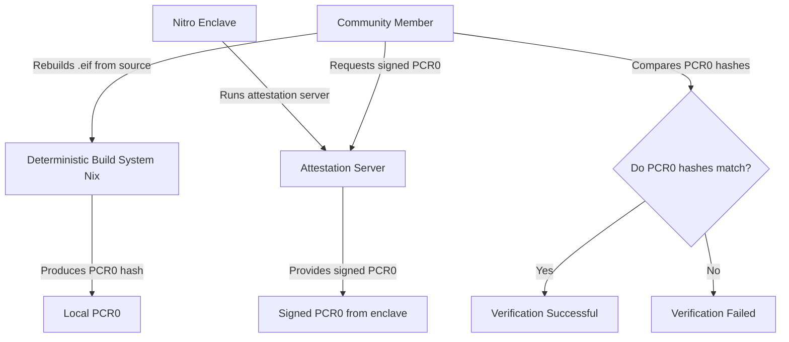
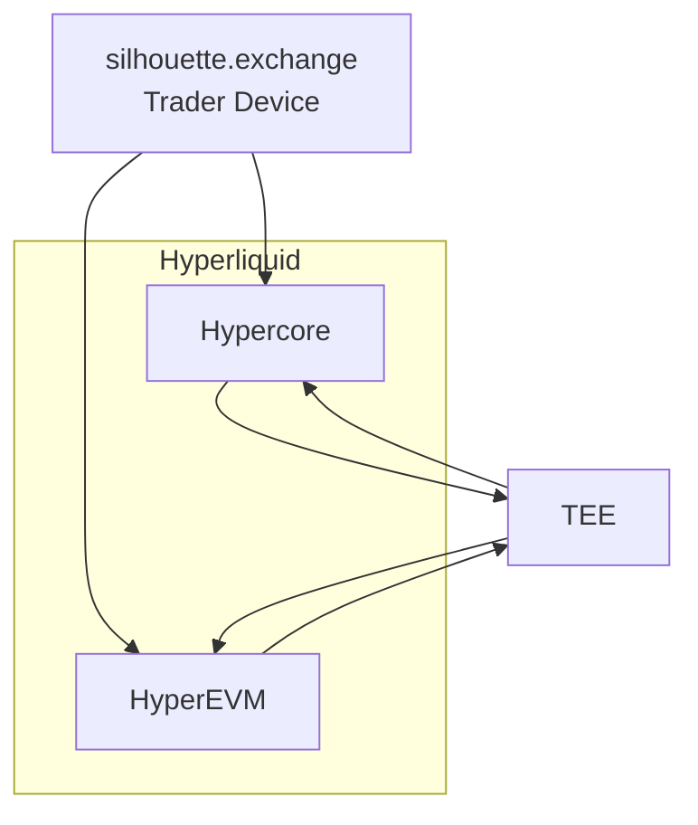

### [TEEs](/docs/architecture/tee)

| HyperCore | HyperCore + HyperEVM | HyperCore + HyperEVM |
|-----------|---------------------|---------------------|
| **Block Height:** 1001 **Block Hash:** 0xabcde12345... **Previous Block:** 0x9876543210... | **Block Height:** 1002 **Block Hash:** 0xdef4567890... **Previous Block:** 0xabcde12345... | **Block Height:** 1003 **Block Hash:** 0x12345fghij... **Previous Block:** 0xdef4567890... |
| **Contains:** • **HyperCore transactions** | **Contains:** • **HyperCore transactions** • **Fast HyperEVM transactions** | **Contains:** • **HyperCore transactions** • **Fast HyperEVM transactions** • **Slow HyperEVM transactions** |
| *This block happens to hold only native HyperCore activity—orders, trades, and vault changes.* | *This block includes both core exchange activity and EVM smart contract calls—showing Hyperliquid's dual-mode design.* | *This block shows the full capability of the unified chain: core trading, fast contract calls, and large/complex EVM executions all included, all linked, all finalised atomically in one global state.* |